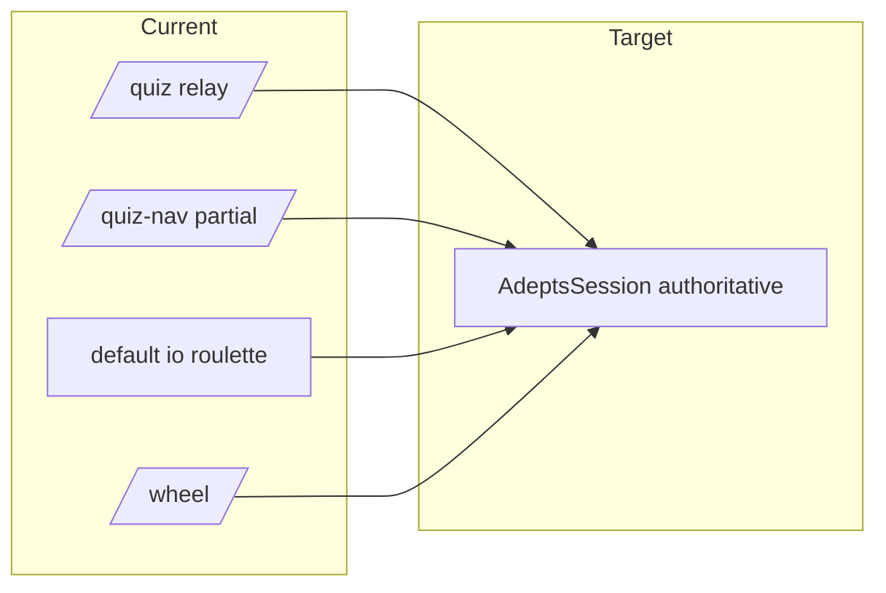

# API implementation plan (from vision.md)

## Progress

### 1. Quiz board **catalog** (static JSON per round)

| | |
|--|--|
| Routes | [adepts-quiz-board-routes.ts](c:\Users\Ilya_Nazarov\wow\game\Node-Script\artifacts\api-server\src\adepts-quiz-board-routes.ts) |
| Store / types | [adepts-quiz-board-store.ts](c:\Users\Ilya_Nazarov\wow\game\Node-Script\artifacts\api-server\src\lib\adepts-quiz-board-store.ts), [adepts-quiz-board-types.ts](c:\Users\Ilya_Nazarov\wow\game\Node-Script\artifacts\api-server\src\lib\adepts-quiz-board-types.ts) |
| HTTP | Public `GET /api/adepts-quiz-board` and `…/:boardId` (1–3); host `PUT` / `PATCH …/theme` / `PATCH …/question` with Bearer secret |
| Persistence | File-backed seeds + `ADEPTS_QUIZ_DATA_PATH` / `ADEPTS_QUIZ_DATA_DIR`; responses synthesize `used: false` on cells |

### 2. Adepts **session** (authoritative in-memory + version)

| | |
|--|--|
| Types + FSM | [adepts-session-types.ts](c:\Users\Ilya_Nazarov\wow\game\Node-Script\artifacts\api-server\src\lib\adepts-session-types.ts), [adepts-session-fsm.ts](c:\Users\Ilya_Nazarov\wow\game\Node-Script\artifacts\api-server\src\lib\adepts-session-fsm.ts) |
| Store | [adepts-session-store.ts](c:\Users\Ilya_Nazarov\wow\game\Node-Script\artifacts\api-server\src\lib\adepts-session-store.ts) — phases, scores, turn seat, `activeBoardId`, opening/spectator/lottery helpers, wheel snapshot hook |
| HTTP | [adepts-session-routes.ts](c:\Users\Ilya_Nazarov\wow\game\Node-Script\artifacts\api-server\src\adepts-session-routes.ts): `POST /api/sessions`, `GET /api/sessions/:sessionId`, host `POST …/transition` |
| Live quiz relay | [adepts-quiz-room-store.ts](c:\Users\Ilya_Nazarov\wow\game\Node-Script\artifacts\api-server\src\lib\adepts-quiz-room-store.ts) (+ relay types) — per-`sessionId` board state, pick/reveal/judge, hover, turn, score delta, `hostQuizRelay` |

### 3. Socket.io **`/adepts`** (commands + `sync`)

[adepts.ts](c:\Users\Ilya_Nazarov\wow\game\Node-Script\artifacts\api-server\src\adepts.ts): `command` handler with host-gated and role-gated paths — e.g. `hostQuizRelay`, `pickCell`, `hostRevealAnswer`, `hostJudgeAnswer`, `hostSetHover`, `hostSetTurn`, `hostAdjustScore`, `hostClearActiveCard`, `transitionPhase`, opening emoji + `openingMarkCorrect`, `spectatorPlaceBet` / `spectatorPicksLock`, lottery set/opt-out/draw, `wheelSpin` / `wheelResultDismiss` when phase is `mini_wheel`. Emits combined `sync` (`session` + `quiz`) to `/adepts` room and pushes quiz snapshot to `/quiz` for legacy subscribers.

### 4. Shared **sessionId** + host verification

- [socket-session-id.ts](c:\Users\Ilya_Nazarov\wow\game\Node-Script\artifacts\api-server\src\lib\socket-session-id.ts) — handshake `sessionId` for `/adepts`, `/quiz`, `/quiz-nav`, `/wheel`.
- [adepts-quiz-board-host-auth.ts](c:\Users\Ilya_Nazarov\wow\game\Node-Script\artifacts\api-server\src\lib\adepts-quiz-board-host-auth.ts) — `verifyAdeptsHostBearer`, `socketHasAdeptsHostSecret` (Bearer header or `auth.adeptsHostSecret` / `auth.token`).
- [quiz.ts](c:\Users\Ilya_Nazarov\wow\game\Node-Script\artifacts\api-server\src\quiz.ts): **no** client `update`; only `sync` from server (driven by `/adepts`).
- [wheel.ts](c:\Users\Ilya_Nazarov\wow\game\Node-Script\artifacts\api-server\src\wheel.ts) + [wheel-room-store.ts](c:\Users\Ilya_Nazarov\wow\game\Node-Script\artifacts\api-server\src\lib\wheel-room-store.ts): per-session room; `wheelSpin` / dismiss require host secret.
- [quiz-nav.ts](c:\Users\Ilya_Nazarov\wow\game\Node-Script\artifacts\api-server\src\quiz-nav.ts): host-only nav/lobby actions use `socketHasAdeptsHostSecret`.
- [visit-track-routes.ts](c:\Users\Ilya_Nazarov\wow\game\Node-Script\artifacts\api-server\src\visit-track-routes.ts): `GET /api/admin/*` behind `requireAdeptsHostAuth`.
- [index.ts](c:\Users\Ilya_Nazarov\wow\game\Node-Script\artifacts\api-server\src\index.ts): `POST /api/admin/reset-roulette` behind `requireAdeptsHostAuth`.

### 5. Client (adepts-game)

[useGameState.ts](c:\Users\Ilya_Nazarov\wow\game\Node-Script\artifacts\game-client\src\apps\adepts-game\hooks\useGameState.ts) uses catalog HTTP ([adeptsQuizBoardApi](c:\Users\Ilya_Nazarov\wow\game\Node-Script\artifacts\game-client\src\lib\adeptsQuizBoardApi.ts)), [getAdeptsCommandSocket](c:\Users\Ilya_Nazarov\wow\game\Node-Script\artifacts\game-client\src\lib\adeptsCommandSocket.ts) / [adeptsSessionId](c:\Users\Ilya_Nazarov\wow\game\Node-Script\artifacts\game-client\src\lib\adeptsSessionId.ts), and relay helpers — aligned with server authority direction.

**Still open vs vision / later phases:** crash-safe session persistence; optional short-lived host tokens instead of long-lived secret in clients; default-namespace **roulette** fully session-scoped and driven from `mini_roulette` + Pandora; donations/stakes **rules** beyond phase types; raccoon / multi-spin wheel semantics; rate limits and automated tests; remove or narrow `hostQuizRelay` once all UI emits fine-grained commands.

## What vision requires (API-relevant)

From [requirements/vision.md](c:\Users\Ilya_Nazarov\wow\game\Node-Script\requirements\vision.md), the backend must eventually support:

- **Session lifecycle**: lobby → opening mini-game → spectator picks → **three rounds** of main quiz → between-rounds (after round 2) → round 3 with stake activation; **only Host** advances rounds and structural transitions.
- **Roles**: Host (authenticated `/admin` in vision), **Player** (seat 1–5), **Spectator**; scores and turn attach to **seat**, not identity.
- **Authoritative rules**: who may reveal answer (Host only), who may open question vs answer, turn after wrong answer (player to the right), score changes (card flows, direct edit, ±100 steps), restore board cells.
- **Card types** driving mode: standard; wheel (1 or 3 spins); Pandora → roulette; raccoon (reassign question to another seat).
- **Mini-games**: opening (emoji + chat + Host marks correct → top 5 → seats); spectator picks (bets before round 1; resolution after three rounds); roulette + **lottery** (Host-built list, spectator opt-out); wheel sectors including **swap, thief, wipe, poem** semantics; between-rounds **donations** and **stakes** for a round-3 card.

## Current API surface (baseline)

| Area | Location | Behavior vs vision |
|------|----------|-------------------|
| HTTP | [app.ts](c:\Users\Ilya_Nazarov\wow\game\Node-Script\artifacts\api-server\src\app.ts), [routes/index.ts](c:\Users\Ilya_Nazarov\wow\game\Node-Script\artifacts\api-server\src\routes\index.ts) | `/api` health; **Adepts** [adepts-session-routes.ts](c:\Users\Ilya_Nazarov\wow\game\Node-Script\artifacts\api-server\src\adepts-session-routes.ts) (`POST/GET /api/sessions`, host `POST …/transition`); [visit-track-routes.ts](c:\Users\Ilya_Nazarov\wow\game\Node-Script\artifacts\api-server\src\visit-track-routes.ts) admin `GET`s **require** host Bearer; [index.ts](c:\Users\Ilya_Nazarov\wow\game\Node-Script\artifacts\api-server\src\index.ts) `reset-roulette` **requires** host Bearer. |
| Quiz board **catalog** (static JSON) | [adepts-quiz-board-routes.ts](c:\Users\Ilya_Nazarov\wow\game\Node-Script\artifacts\api-server\src\adepts-quiz-board-routes.ts) | Public **GET** per round; mutations host-gated. |
| Quiz board **live** sync | [quiz.ts](c:\Users\Ilya_Nazarov\wow\game\Node-Script\artifacts\api-server\src\quiz.ts) | `/quiz`: **read-only** `sync` from [adepts-quiz-room-store.ts](c:\Users\Ilya_Nazarov\wow\game\Node-Script\artifacts\api-server\src\lib\adepts-quiz-room-store.ts); mutations only via `/adepts` `command` (or host relay). |
| Lobby / nav / chat | [quiz-nav.ts](c:\Users\Ilya_Nazarov\wow\game\Node-Script\artifacts\api-server\src\quiz-nav.ts) | Per-`sessionId` nav state; sensitive host actions gated by `socketHasAdeptsHostSecret`. **Parallel** to Adepts session FSM (opening/spectator/lottery also exist on session — convergence TBD). |
| Presence | [artifacts/api-server/src/quiz-players-registry.ts](c:\Users\Ilya_Nazarov\wow\game\Node-Script\artifacts\api-server\src\quiz-players-registry.ts) | Nick/role registry for lobby; useful building block. |
| Roulette | [artifacts/api-server/src/game.ts](c:\Users\Ilya_Nazarov\wow\game\Node-Script\artifacts\api-server\src\game.ts) | Default namespace: 5 slots, spin/shoot — **standalone**, not linked to a quiz session or Pandora. |
| Wheel | [wheel.ts](c:\Users\Ilya_Nazarov\wow\game\Node-Script\artifacts\api-server\src\wheel.ts) | `/wheel`: per-`sessionId` room; **host secret** required to spin/dismiss; physics in [wheel-room-store.ts](c:\Users\Ilya_Nazarov\wow\game\Node-Script\artifacts\api-server\src\lib\wheel-room-store.ts). Spun from `/adepts` when phase is `mini_wheel`. |

Client ([useGameState.ts](c:\Users\Ilya_Nazarov\wow\game\Node-Script\artifacts\game-client\src\apps\adepts-game\hooks\useGameState.ts)): loads catalog from HTTP API where configured, uses `/adepts` command socket + session id; merges catalog with server `sync` quiz payload.

## Design principles (before coding)

1. **Single source of truth**: introduce an **Adepts session** document (versioned) that the server updates only through validated commands; clients receive **patches or full snapshots** on `sync`. Deprecate blind `update` on `/quiz` for production rooms (keep optional dev relay if needed).
2. **Host verification**: vision ties Host to **`/admin` + authentication** — implement **shared secret or session token** (env-based API key, signed JWT, or login flow) checked on **every host-only socket event and admin HTTP route**; do not rely on `localStorage` role alone.
3. **Stable `roomId`**: one show = one session id; wire quiz, nav, roulette, wheel subscribers to the same id (query param or path) so mini-games attach to the same state machine.
4. **Explicit FSM**: model phases (`lobby`, `opening_show`, `spectator_picks`, `round_n`, `mini_wheel`, `mini_roulette`, `between_rounds`, …) in code; events are valid only in certain phases.

## Phased implementation

### Phase 1 — Session core + security

- Add **session store** (in-memory first; Redis later if multi-instance): `sessionId → { state, version, secrets }`.
- **HTTP**: `POST /api/sessions`, `GET /api/sessions/:sessionId`, host `POST …/transition` — **done** ([adepts-session-routes.ts](c:\Users\Ilya_Nazarov\wow\game\Node-Script\artifacts\api-server\src\adepts-session-routes.ts)). Short-lived host tokens vs raw `ADEPTS_HOST_SECRET` in clients — **open**.
- **Socket**: `/adepts` with `sessionId` + host secret in handshake for host commands — **done** ([adepts.ts](c:\Users\Ilya_Nazarov\wow\game\Node-Script\artifacts\api-server\src\adepts.ts)). `/quiz` read-only sync — **done**.
- Migrate **broadcast payloads** from [quiz-nav.ts](c:\Users\Ilya_Nazarov\wow\game\Node-Script\artifacts\api-server\src\quiz-nav.ts) into session state — **partial** (Adepts session owns phases/opening/picks/lottery; quiz-nav still holds lobby/chat/board chrome).
- **Lock down** visit-track admin and `reset-roulette` — **done** (see [Progress](#progress)).

### Phase 2 — Main game authority (rounds, board, scoring, turn)

- Define **server-side types** for: `RoundIndex`, `CellId` (category × value), `used` flags, `activeCard` (type, payload refs, reveal flags), `scores[1..5]`, `currentTurnSeat`, `lastPickerSeat` (for “pick next cell”).
- **Host commands** (examples): `openQuestion`, `revealAnswer`, `judgeAnswer` (correct/wrong with point delta and turn advance), `adjustScore` (seat, delta or set, clamp rules), `passTurn`, `restoreCell`, `advanceRound`, `setBoardNav` (which board grid is shown).
- **Player commands**: `openQuestion` (question-only reveal path per vision), `pickCell` when allowed; reject if not current seat or phase.
- **Spectator**: read-only sync + chat; chat already exists — attach nick + session and rate limits.
- **Client migration**: `/adepts` `command` + `sync` — **in progress** in adepts-game; `hostQuizRelay` still available for bulk state during migration. Catalog `GET` in use.

### Phase 3 — Card types and mini-game bridges

- **Standard / raccoon / wheel / Pandora**: encode `cardType` on cells; transitions set `miniGame` sub-state.
- **Wheel**: either embed wheel FSM in session (spins remaining, pending special choice: swap partner, thief target) or proxy [wheel.ts](c:\Users\Ilya_Nazarov\wow\game\Node-Script\artifacts\api-server\src\wheel.ts) through session commands so **segment draw is server RNG** and **active Player** is enforced.
- **Roulette**: refactor [game.ts](c:\Users\Ilya_Nazarov\wow\game\Node-Script\artifacts\api-server\src\game.ts) into a **session-scoped** module (same RNG/turn rules) triggered from `Pandora`; on eliminate: update seat map (Player → Spectator), expose **lottery pool** (spectators minus opt-out).
- **Lottery**: Host events `setLotteryCandidates`, `runLotteryDraw` → server assigns seat; persist opt-out per spectator id.
- **Opening show**: store `emojiRound` (current prompt id), `spectatorGuesses`, Host `markCorrect(nick)`; on close: compute top 5 → write `seatAssignment` (vision: seats from mini-game).
- **Spectator picks**: `placeBet(spectatorId, seatNumber)` before round 1 lock; after game over compute winners vs final scores.

### Phase 4 — Between-rounds and stakes

- After round 2 end (Host transition): phase `story_video` then `donations`; store `donations[seat]` validated (0 ≤ x ≤ score).
- **Stakes** stored on session; on specific Round 3 card open: Host or rule engine applies ×2 and redistribution payload; broadcast score changes.

### Phase 5 — Hardening

- Persistence (optional): SQLite/Postgres for crash recovery and audit log of Host actions.
- Rate limits, message size caps (already partially there), reconnection resync with `version`.
- Tests: FSM unit tests + socket integration tests per role.

## Open product decisions (capture early)

- **Seat vs socket**: vision allows changing who sits in a seat — decide binding (reconnect by nick, invite code per seat, or Host drag-drop).
- **Single vs multiple boards**: vision has 3 rounds × categories; HTTP catalog uses **board ids 1–3** aligned with rounds; legacy client `MAX_BOARD`/indices may still need a single naming pass (`round` vs `boardIndex`).
- **Automation vs Host**: vision says wheel scoring “by Host or automated” — specify which sectors auto-apply numeric deltas vs require Host confirm.

## Suggested first milestone

**Delivered (rolling):** catalog HTTP + host secret; in-memory **AdeptsSession** + FSM + HTTP; **`/adepts` commands** + versioned `sync`; session-scoped **`/quiz`** (no client `update`); host-gated **wheel**, **visit-track** admin, **reset-roulette**, **quiz-nav** host paths.

**Next focus:** persistence / host token UX; retire **`hostQuizRelay`** where possible; session-scope **roulette** + `mini_roulette`; **donations/stakes** logic; tests and rate limits (Phase 5 below).
